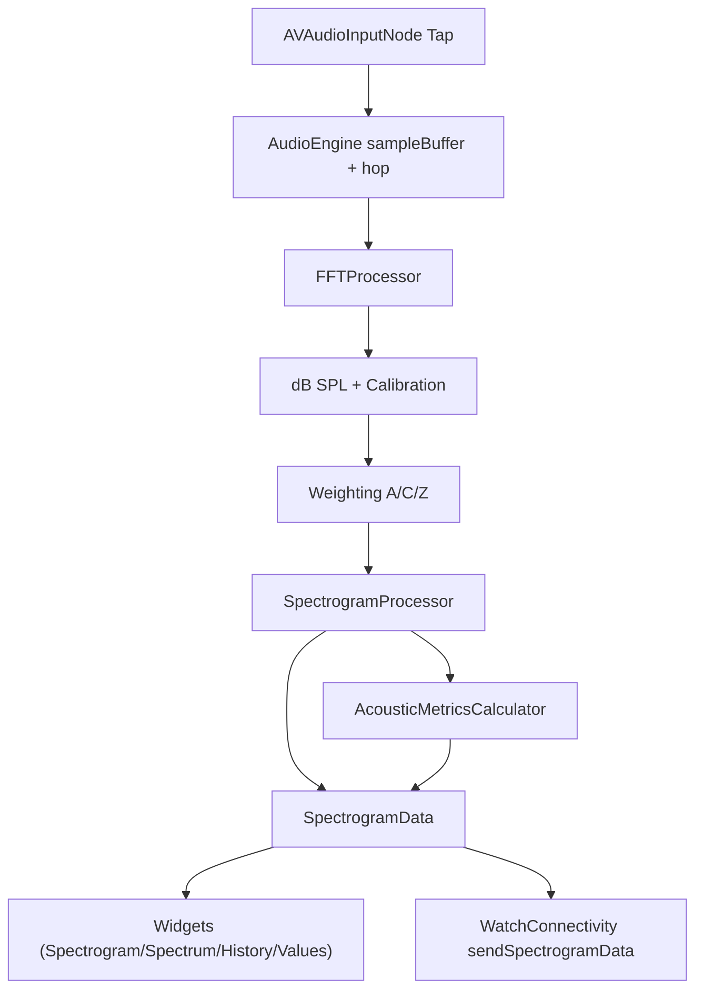

# SpektoWatch2 Fullstack-Übersicht

Stand: 2026-05-06  
Repo: `SpektoWatch2` (iOS + watchOS, Swift/SwiftUI, ohne externe Package-Dependencies)

## 1) Stack auf einen Blick

- Sprache/UI: Swift, SwiftUI
- Audio/DSP: AVFoundation, Accelerate/vDSP
- Rendering: Metal/MetalKit (Live- und Playback-Spektrogramm)
- Kommunikation: WatchConnectivity
- State/Reactive: Combine, `@Published`, `EnvironmentObject`
- Logging/Profiling: `OSLog`, `os_signpost`, Diagnose-Flags via Scheme-Env
- Tests: XCTest (Unit, Integration, UI), `.xctestplan`, `run_tests.sh`

## 2) Targets und Projektstruktur

### Targets
- `SpektoWatch2` (iOS App)
- `SpektoWatch Watch App` (watchOS App)
- `SpektoWatch2Tests` / `SpektoWatch2UITests`

### Hauptordner
- `SpektoWatch2/` iOS-UI, AudioEngine, DSP, Renderer, Widget-System
- `SpektoWatch Watch App/` watch-UI und WatchAudioEngine
- `Shared/` gemeinsame Payloads, Mapping, Notifications, Logging

### Wichtiger Build-Mechanismus
Das Projekt nutzt **filesystem-synced groups** in `project.pbxproj` mit `PBXFileSystemSynchronizedBuildFileExceptionSet`.  
Damit werden einzelne Dateien trotz gleicher Namen gezielt aus Targets ausgeschlossen (wichtig bei Legacy-Duplikaten).

## 3) Laufzeit-Architektur (iOS)

### App Bootstrap
- Entry: `SpektoWatch2/SpektoWatch2App.swift`
- Instanziert und injiziert:
  - `AudioEngine`
  - `BandstopFilterManager`
  - `WatchConnectivityManager`
  - `RecordingManager`
  - `FFTConfiguration`

### UI-Schichten
- Root: `ContentView` -> `ModularDashboardView`
- Dashboard-Verwaltung:
  - `DashboardViewModel`
  - `DashboardManager` (persistiert Widget-Layout in `UserDefaults`)
- Widget-Rendering:
  - `WidgetCardView` + spezifische Widgets (`SpectrogramWidget`, `FrequencySpectrumWidget`, `LevelHistoryWidget`, etc.)
- Einstellungen:
  - Global: `SpectrogramSettingsView` (Audioquelle, Zeit-/Frequenzbewertung, FFT, Kalibrierung, Glättung)
  - Pro Widget: `WidgetSettingsView` mit Toggle `useWidgetOverrides`

### DSP-Pipeline (zentral)
- Zentraler Einstieg: `AudioEngine.processSamples(...)` / `processFFTFrame(...)`
- Komponenten:
  - `FFTProcessor` (eine zentrale FFT-Quelle für Live-Widgets)
  - `FrequencyWeightingProcessor` (A/C/Z)
  - `SpectrogramProcessor` (Bandstop, Binning, zeitliche Glättung, Oktavbänder)
  - `AcousticMetricsCalculator` (LAF/LAS/LCF/.../LAeq/Perzentile)
- Publiziert pro Frame:
  - `currentSpectrogramData`
  - `currentSpectrum`
  - `currentOctaveBands{Z,A,C}`
  - Pegel- und Historienwerte

## 4) Rendering-Pipeline

### Live-Spektrogramm
- Renderer: `HighEndSpectrogramAdapter` + `HighEndSpectrogramShaders.metal`
- Verarbeitung:
  - Eingang: FFT-Magnituden aus `currentSpectrogramData`
  - Frequenzmapping: aktuell logarithmische Frequenzachse (20 Hz - 20 kHz)
  - Dynamiknormalisierung + optional Frequenzglättung
  - Ringpuffer-Textur + column-based Update

### Spektrum-Widget
- `FrequencySpectrumWidget` / `SpectrumBandChartView`
- Nutzt dieselbe zentrale Datenquelle (`currentSpectrogramData`) plus voraggregierte Dritteloktavbänder.

### Playback-Spektrogramm
- Separater Pfad in `PlaybackSpectrogramView.swift`
- Enthält eigene FFT-Berechnung für Offline/Playback-Szenarien (nicht Teil des Live-Pfads).

## 5) Watch-Architektur

### Datenfluss

- Watch App Entry: `SpektoWatch Watch App/SpektoWatchApp.swift`
- Lokale Watch-Verarbeitung:
  - `WatchAudioEngine` macht zusätzlich eine lokale FFT für sofortige Anzeige auf der Uhr.
  - Parallel wird Audio an iPhone gesendet, wo die Hauptverarbeitung läuft.

## 6) Datenmodelle, Persistenz und Konfig-Priorität

### Kernmodelle
- `Shared/SpectrogramData.swift`
  - `frequencies`, `magnitudes`, optional `magnitudesA/C`, `levels`, `sampleRate`, `timestamp`
- `Shared/WatchWidgetConfiguration.swift`
  - Watch-Dashboard-Layout und Persistenz

### Persistenz
- Dashboard-Widgets iOS: `DashboardConfiguration_v5` (`DashboardManager`)
- FFT-Settings: `fft_*` Keys (`FFTConfiguration`)
- Kalibrierung/Glättung: `calibrationOffset`, `spectrogramFrequencySmoothing` (`AudioEngine`)
- Watch-Layout: `watchDashboardConfig` (`WatchDashboardConfig`)

### Settings-Priorität (heute)
1. Global App-Settings (Engine/FFTConfiguration)
2. Widget-Settings nur wenn `useWidgetOverrides == true`
3. Sonst Fallbacks aus `WidgetSettings.default*`

Hinweis: Bei einigen Widget-Parametern (z. B. Colormap/TimeSpan/Sensitivity) ist der Fallback aktuell ein statischer Default, nicht immer ein globaler Runtime-Wert.

## 7) Tests und Qualitätssicherung

### Testsuite
- Unit/Integration: `SpektoWatch2Tests/*`
- UI: `SpektoWatch2UITests/*`
- Runner: `run_tests.sh`

### Auffälligkeiten
- Mehrere Tests sind aktuell per `XCTSkip` deaktiviert (u. a. Memory-Management- oder Stress/Race-Condition-Hinweise in Testcode).

### Diagnose-Flags
- `SPEKTO_DEBUG_SPECTRUM=1`  
  -> loggt `[SpectrumDiag] ...` aus `AudioEngine`
- `SPEKTO_DEBUG_WIDGET_SPECTRUM=1`  
  -> loggt `[SpectrumWidgetDiag] ...` aus `AudioWidgets`

## 8) Redundanzen und potenzielle Konflikte

### Vorhandene Duplikate (historisch/legacy)
- `SpektoWatch2/RecordingManager.swift` und `SpektoWatch2/Managers/RecordingManager.swift`
- `SpektoWatch2/WatchConnectivityManager.swift` und `Shared/WatchConnectivityManager.swift`

Diese Doppelungen sind teilweise per Target-Exceptions entschärft, erhöhen aber Wartungsrisiko und Verwechslungsgefahr.

### Harte Samplerate-Annahmen
- Einzelne Komponenten rechnen weiterhin implizit mit 44.1 kHz (z. B. in bestimmten Zeitachsen-/Buffergrößen-Berechnungen).
- Der zentrale Live-DSP-Pfad in `AudioEngine` arbeitet bereits mit dynamischer `processingSampleRate`.

## 9) Bekannte Performance-Schulden (Swift-Seite, Audit Mai 2026)

Der Metal/Shader-Pfad wurde Jan 2026 optimiert (→ `SPECTROGRAM_REFERENCE.md`). Der folgende Audit identifiziert die verbleibenden Bottlenecks auf der **Swift-Seite** des Audio-Hot-Paths. Der Processing-Thread läuft bei ≈ 86 FFTs/s — jede skalare Schleife multipliziert sich entsprechend.

Detaillierte Fixes mit Codebeispielen: `PERFORMANCE_REVIEW.md`

### Priorität 1 — größter Effekt, geringstes Risiko

| # | Datei | Problem | Fix | Erwarteter Effekt |
|---|-------|---------|-----|-------------------|
| 1 | `Processing/FrequencyWeightingProcessor.swift:66` | `log10(gain[i])` wird pro Frame neu berechnet, obwohl Gains konstant sind. 3 × 4096 × 86 ≈ 1 M `log10`-Calls/s | `gainsDB` bei `init` vorberechnen, Hot-Path per `vDSP_vadd` | ~3–5 % CPU |
| 2 | `AudioEngine.swift:1167` | A-, C- und Z-Gewichtung werden **immer** berechnet, auch wenn nur eine angezeigt wird. `spectrogramProcessor.process()` läuft 3×. | Berechnung auf aktive Gewichtung + `isMeasurementRecording`-Gate beschränken | **~30–40 % Reduktion in `processFFTFrame`** (größter Einzelgewinn) |
| 3 | `Processing/FFTProcessor.swift:381` | Skalare `log10`-Schleife über 4096 Bins in `convertToDB` | `vvlog10f` aus Accelerate + `vDSP_vsmul` | 5–8× schneller auf diesem Helper |
| 4 | `MeasurementDataWriter.swift:43` | Synchrone Disk-Writes (`fileHandle.write`) direkt auf dem Audio-Thread. Bei 86 Frames/s × ~17 KB = ~1,4 MB/s → Stalls und Frame-Drops auf älteren Geräten | Pre-alloc `Data`, Writes auf serielle Dispatch Queue auslagern | Eliminiert Frame-Drops beim Recording auf iPhone 11 o. ä. |
| 5 | `Processing/FFTProcessor.swift:330` | `performFFT` gibt `[Float]`-Kopie zurück → ~1,3 MB/s Allokation auf Hot-Path | Buffer-out Variante; `AudioEngine` hält reusable `[Float]`. Skalare Interleave-Schleife (Z. 356) → `vDSP_ctoz`. `NSLock` → `os_unfair_lock` | ~5–10 % CPU |

### Priorität 2 — Accelerate-Sweep durch restliche DSP-Kette

| # | Datei | Problem | Fix |
|---|-------|---------|-----|
| 6 | `AudioEngine.swift:1247` | Skalare Energy-Loop (magSq, energyA/C/Z) | `vDSP_vsq` + `vDSP_dotpr`; `aWeightsSq` einmalig vorberechnen |
| 7 | `AudioEngine.swift:1161` | Skalares `calibrationOffset`-Add über 4096 Bins | `vDSP_vsadd` |
| 8 | `SpectrogramProcessor.swift:104` | `log10(attenuationMap[i])` per Bin pro Frame, obwohl Map nur bei Filteränderung wechselt | `attenuationDB: [Float]` cachen, Hot-Path → `vDSP_vadd` |
| 9 | `SpectrogramProcessor.swift:175` | `while + .append()` baut Output-Array; `reserveCapacity` vorhanden, aber Zuweisung per Index fehlt | Exakte Größe prä-allokieren, Index-Zuweisung; oder `vDSP_desamp` für Binning |
| 10 | `SpectrogramProcessor.swift:162` | Skalares `max`-Loop über Oktavband-Range | `vDSP_maxv` |

### Priorität 3 — Input-Pfad & UI

| # | Datei | Problem | Fix |
|---|-------|---------|-----|
| 11 | `AudioEngine.swift:1021` | `Array(UnsafeBufferPointer(...))` auf jedem Audio-Callback → frische Allokation | Pre-alloc reusable `[Float]` mit `maxFrameCount`, dann `memcpy` |
| 12 | `AudioEngine.swift:1049` | `newSamples.max()` ist falsch (signed max, dann abs) und scalar | `vDSP_maxmgv` — schneller *und* korrekt |
| 13 | `AudioEngine.swift:1400` | 8 separate `@Published` Writes pro UI-Tick → 8× `objectWillChange` | In einen `AudioSnapshot`-Struct bündeln, einmal publishen |
| 14 | `AudioEngine.swift:1427` | `magnitudes.map { $0 - offset }` bei Watch-Sends → Allokation @ 10 Hz | `vDSP_vsadd`; oder Offset im Packet-Header mitschicken |
| 15 | `AudioEngine.swift:1416` | `levelHistory.removeFirst()` ist O(n) | Ring-Buffer-Struct verwenden |

### Empfohlene Reihenfolge

`#1, #5, #3` → `#2` → `#4` → `#6–#10` → `#11–#15`

Fixes 1–3 allein sollen `processFFTFrame` um **40–50 %** reduzieren (iPhone 12-Klasse). Benchmarks vor/nach: `PerformanceProfilingTests.swift` erweitern.

---

## 10) End-to-End für Live iOS (Referenzfluss)

## 11) Kurzfazit

- Die Live-Analyse ist zentral in `AudioEngine` gebündelt und wird von den iOS-Widgets gemeinsam genutzt.
- Watch unterstützt Hybridbetrieb (lokale Sofort-FFT + iPhone-Hauptverarbeitung).
- Metal/Shader-Seite ist optimiert (Jan 2026) — Performance ist im Budget.
- Der nächste Optimierungsblock liegt auf der **Swift-DSP-Seite**: skalare Schleifen, redundante A/C/Z-Berechnung und synchrone Disk-Writes (→ Abschnitt 9, `PERFORMANCE_REVIEW.md`).
- Struktureller Schuldenblock: Legacy-Duplikate (`RecordingManager`, `WatchConnectivityManager`) und einzelne verbleibende 44,1-kHz-Hardcodes außerhalb des Kernpfads.
